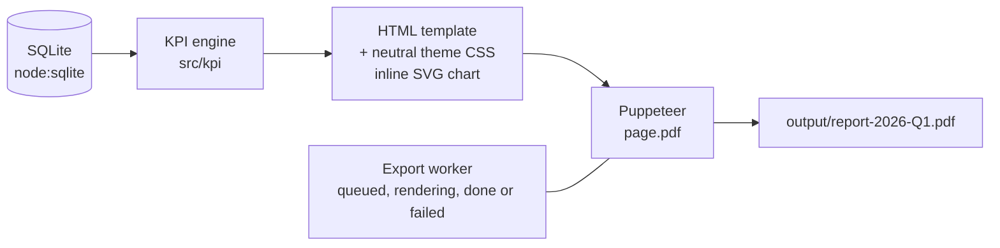
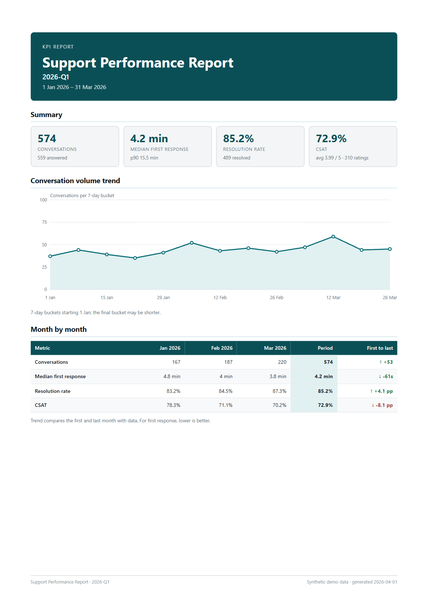
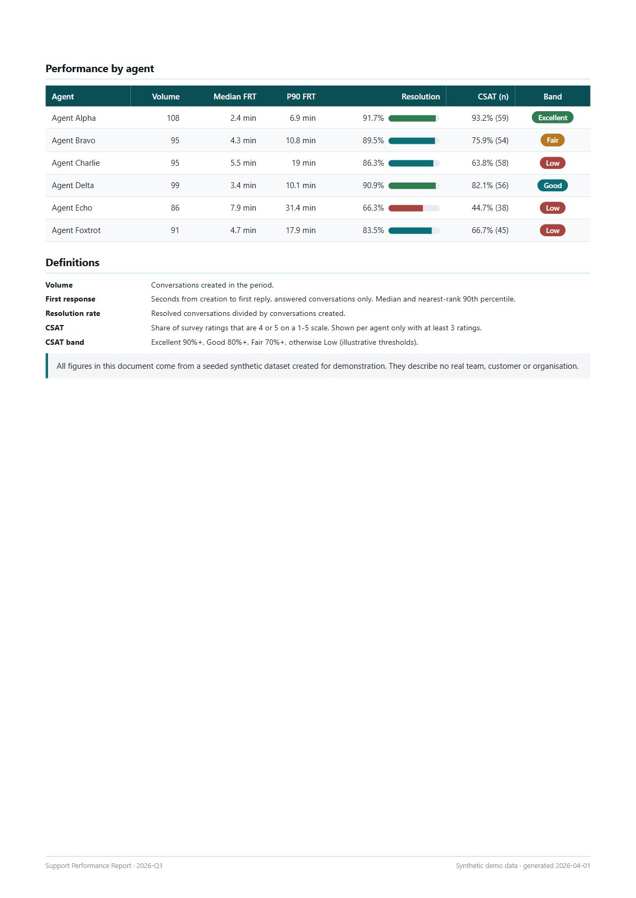

# automated-pdf-reporting

Generate polished, brand-neutral KPI PDF reports from a database with Puppeteer HTML templates, on demand or on a schedule.

## Problem

Weekly or monthly KPI reports tend to be assembled by hand from spreadsheets. This repo turns that into one command: query a SQLite database, compute the KPIs, render an HTML template, and print it to PDF with headless Chrome. It runs on a seeded synthetic dataset (6 fictional agents, 3 months), so everything here is reproducible without any real data.



## Tech

Node 22.13+ (developed on 24), built-in `node:sqlite`, `puppeteer` (bundled Chrome), `node:test`. No Docker, no web server, no external CDN.

## Quick start

```bash
git clone https://github.com/abdalrahmnamo-svg/automated-pdf-reporting.git
cd automated-pdf-reporting
npm ci
npm run puppeteer:install       # only if Puppeteer did not download Chrome (or set PUPPETEER_EXECUTABLE_PATH)
npm run seed                    # creates data/support.db (deterministic)
npm run report -- --period 2026-Q1
# -> output/report-2026-Q1.pdf
npm test
```

Other commands:

| Command | What it does |
| --- | --- |
| `npm run report -- --from 2026-01-15 --to 2026-02-10` | Custom inclusive date range (UTC) |
| `npm run report -- --period 2026-02` | A single calendar month |
| `npm run report:html -- --period 2026-Q1` | Write `output/report-2026-Q1.html` only, for fast template iteration |
| `npm run report:schedule -- --every 60` | In-process `setInterval` scheduler; defaults to the quarter of the newest conversation, or pass `--period`/`--from`/`--to`. `--once` renders once and exits |
| `npm run docs:sample` | Regenerate `docs/sample-report.pdf` and the page screenshots |

Set `REPORT_TITLE` (see `.env.example`) to change the report title; `REPORT_TIMEOUT_MS` changes the render timeout (default 60000).

## Sample output

[`docs/sample-report.pdf`](docs/sample-report.pdf) (2 pages, 2026-Q1)




## KPI definitions

| KPI | Definition |
| --- | --- |
| Volume | Conversations created in the period |
| First response time | Seconds from creation to first reply, answered conversations only. Reported as median and nearest-rank 90th percentile |
| Resolution rate | Resolved conversations / conversations created |
| CSAT | Ratings of 4 or 5 (scale 1-5) / all ratings. Per agent it is shown only with at least 3 ratings |

KPIs with no underlying data are `null` and print as an em dash, never `0` or `NaN`.

## Engineering notes

- **Worker status.** `ExportWorker` is an in-process queue (concurrency 1). A job moves `queued -> rendering -> done | failed`; the allowed transitions live in `src/worker/exportStatus.js` and illegal ones throw.
- **Timeouts and retry.** Each render attempt is raced against a timeout and gets an `AbortSignal`; the default renderer closes its browser on abort. A failed or timed-out attempt is retried once (`rendering -> queued -> rendering`) before the job is marked `failed` with the error message.
- **Why HTML to PDF.** The template is plain HTML/CSS with an inline SVG chart, so layout, tables, and print rules (`@page`, page breaks) come from the browser engine, and `npm run report:html` gives a fast preview loop. A PDF drawing library would mean hand-positioning every element.
- **Deterministic seed.** `scripts/seed.mjs` uses a fixed-seed PRNG (mulberry32), so the same database is produced on every run. The sample PDF uses a fixed "generated" date for reproducibility.
- **Self-contained theme.** `src/report/performanceTheme.css` uses CSS variables, system fonts, and no external URLs. A test checks the document has no images, scripts, or remote references.
- **Chrome discovery.** `src/puppeteerLaunch.js` tries Puppeteer's bundled Chrome, then system Chrome/Edge/Chromium. Tests that need a browser skip themselves (with a reason) if none can be launched.

## Limitations

- Fixed layout for two A4 sheets; a table longer than a page flows onto extra pages but is not otherwise paginated or repeated beyond the browser defaults.
- The scheduler is a simple in-process timer, not a durable job system; if the process stops, nothing runs. The job queue and statuses are in memory.
- UTC only; no timezone handling.
- English-only output. CSAT band thresholds are illustrative.
- `node:sqlite` is still flagged experimental in some Node versions and prints a warning.

## Background

Reworked from an internal reporting tool into a generic, synthetic-data demo; no real data, branding, or infrastructure is included.

## License

MIT
